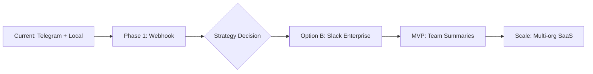

# OpenSpec Proposal: Real-Time Bot Integration & Platform Evolution

## Status
🔵 **PROPOSED** | Priority: High | Estimated: 2-4 weeks

## Problem Statement

The current Commit Content Tracker requires local polling to receive Telegram commands, limiting its usefulness as a production system. Additionally, there's an opportunity to pivot/expand the core value proposition beyond social media content to enterprise developer reporting.

## Proposed Solution

### Phase 1: Telegram Webhook Implementation (1 week)

Implement a proper webhook system using Cloudflare Workers (free tier) to receive Telegram updates and trigger GitHub Actions.

```
Telegram → Cloudflare Worker → GitHub Actions (repository_dispatch) → Process
```

#### Technical Approach:
1. **Cloudflare Worker** as webhook receiver
   - Receives Telegram updates via webhook
   - Validates Telegram signature
   - Triggers GitHub `repository_dispatch` event
   
2. **Telegram Webhook Setup**
   - Register webhook URL with Telegram Bot API
   - Configure SSL (Cloudflare provides this)

#### Deliverables:
- [ ] Cloudflare Worker script for webhook reception
- [ ] Webhook registration script
- [ ] Updated documentation

---

### Phase 2: Platform Direction Decision

#### Option A: Public Telegram Bot + Mobile App (B2C)

| Aspect | Details |
|--------|---------|
| Target | Individual developers, content creators |
| Monetization | Subscription ($5-15/month) |
| Features | Multi-account X posting, template library, analytics |
| Effort | High (app development, multi-tenant infra) |
| Market Fit | Moderate (crowded space) |

#### Option B: Slack Bot for Enterprise Developer Reporting (B2B) ⭐ RECOMMENDED

| Aspect | Details |
|--------|---------|
| Target | Engineering teams, companies |
| Monetization | Per-seat SaaS ($10-50/seat/month) |
| Features | Sprint summaries, release notes, manager dashboards |
| Effort | Medium (Slack API is simpler than mobile) |
| Market Fit | Strong (real enterprise pain point) |

##### Why Slack for Enterprise?

1. **Clear ROI** - "What did my team ship this sprint?" is a question asked daily
2. **Budget exists** - Companies pay for developer tools
3. **Natural workflow** - Reports delivered where teams already work
4. **Less competition** - AI-powered commit summarization for teams is nascent

##### Example Use Cases:
- `/devreport weekly` - "Here's what your team shipped this week"
- `/devreport sprint` - Generate sprint review summary
- `/devreport @john` - What did John work on?
- `/devreport release v2.0` - Generate release notes between tags
- Scheduled channel posts: "Monday morning: Last week's team accomplishments"

---

## Recommended Path Forward



### Immediate Next Steps:
1. Implement Telegram webhook (Phase 1)
2. Validate Slack bot concept with 2-3 friendly companies
3. Build Slack MVP if validated

---

## Appendix: Slack Implementation Sketch

```typescript
// Slack slash command handler
app.post('/slack/command', async (req, res) => {
  const { command, text, team_id, user_id } = req.body;
  
  switch (command) {
    case '/devreport':
      const [period, scope] = text.split(' ');
      const commits = await fetchTeamCommits(team_id, period);
      const summary = await generateAISummary(commits);
      await postToSlack(summary, req.body.channel_id);
      break;
  }
});
```

## Questions for Decision

1. Do you want to proceed with the Telegram webhook implementation first?
2. Are you interested in validating the Slack enterprise concept?
3. Do you have any companies/teams that would be early adopters?
